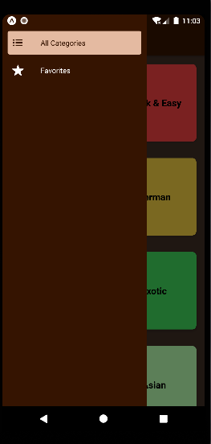

# My Recipe Book App

Welcome to the "My Recipe Book App" repository! This is a mobile application built with React Native that serves as a recipe book for various dishes. It allows you to explore different categories of dishes, view their details, and manage favorites.

## Features

- **Category Screen**: The opening screen displays various categories of dishes. Tap on a category to navigate to a list of dishes under that category using stack navigation.
- **Dish Details**: When you tap on a dish from the list, you will be taken to the details screen where you can view the recipe and other information about the dish.
- **Favorite Management**: In the dish details screen, you will find a star icon in the header that allows you to add or remove the dish from your favorites using the Ionicons library.
- **Drawer Navigation**: The opening screen also includes a drawer navigation with two screens: "All Categories" and "Favorites". These screens use nested navigation to provide a seamless user experience.
- **App-wide State Management**: The app's state management is handled using the Context API, allowing for easy sharing of data across components.

## Screenshots

 
 
 
 
 


## How to Run the Application

To run the My Recipe Book App on your mobile device or emulator, follow these steps:

1. Clone the repository to your local machine:

   ```
   git clone https://github.com/Hafilu/My-Recipe-Book.git
   ```

2. Navigate to the project directory:

   ```
   cd My-Recipe-Book
   ```

3. Install the required dependencies:

   ```
   npm install
   ```

4. Start the development server:

   ```
   npm start
   ```

5. Follow the instructions in the terminal to launch the app on your device or emulator.

## Dependencies

The My Recipe Book App project has the following dependencies:

- React Native: The core framework for building mobile applications.
- React Navigation: A library for implementing navigation between screens. Mainly Stack Navigation and Drawer Navigation
- Ionicons: A library of icons for React Native, including the star icon for favorites.
- Other dependencies are listed in the `package.json` file.

Make sure to install any required dependencies before running the application.

## Data Source

The dish details and images are provided by a dummy data file included in the project. You can customize or replace this data file with your own recipes.

## Contributing

Contributions are welcome! If you encounter any issues or have suggestions for improvements, please create an issue or submit a pull request. Please follow the existing coding style and conventions.

## Acknowledgments
Special thanks to Maximilian for helping me to create this amazing Recipe app!

## Contact

If you have any questions, suggestions, or feedback, please feel free to contact me at hafliue.c@gmail.com.

Thank you for visiting the "My Recipe Book App" repository. Happy cooking and enjoy exploring new recipes!
